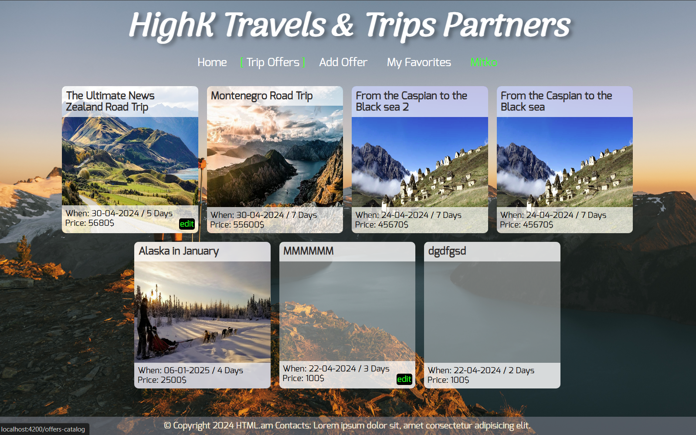
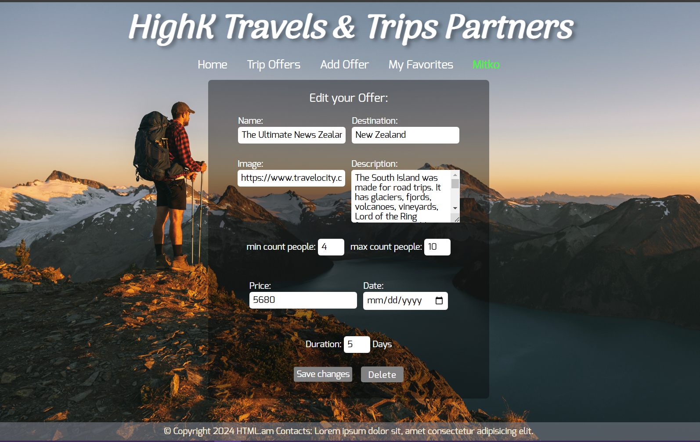
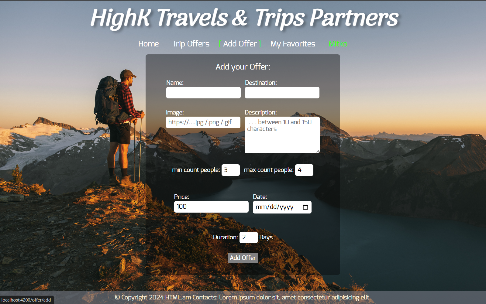
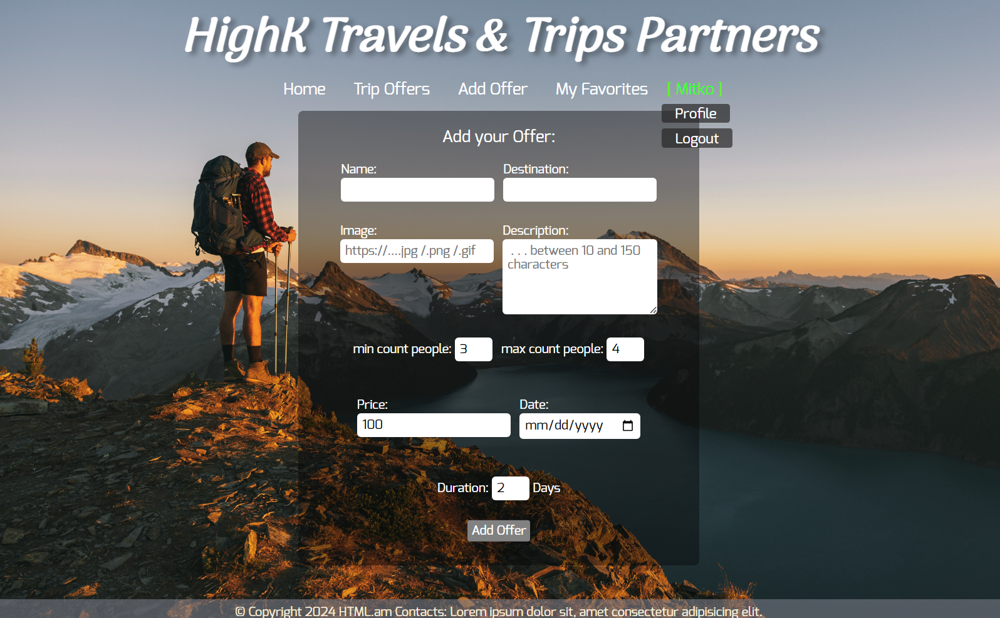
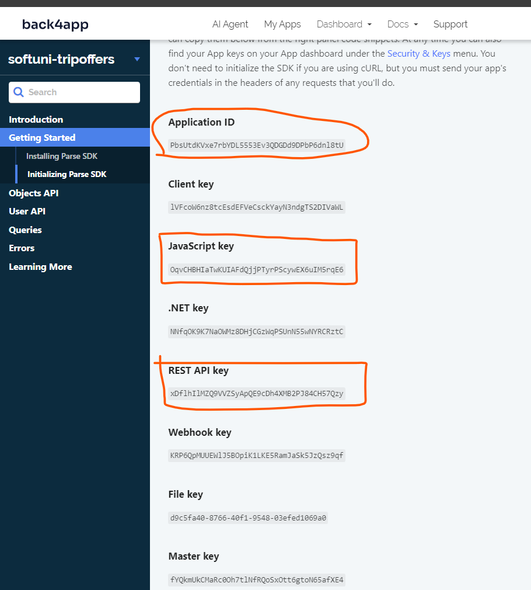
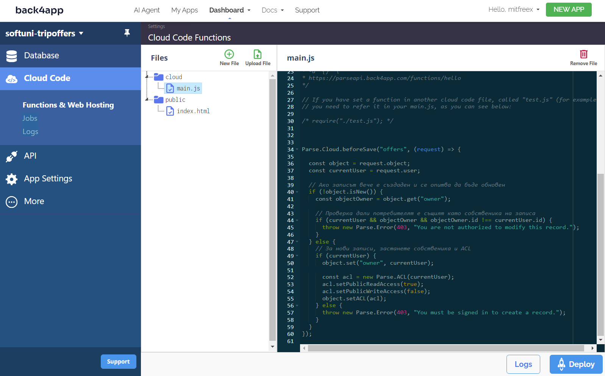
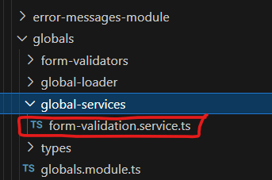

# TripsOffers

### Home page with logged User:


##
##

### Catalog of offers with logged user
>preview cards of offers:



##
##


### View details offer-page (in catalog page):


##
##

### Edit Offer page:


##
##

### Add-Offer page (only for logged users)



##
##

### My Favorites page (only for logged Users)
> . . . STILL in progress

##
##

### Profile links for logout and profile info
profil info still in progress


##
##

### Layout view for Guests:


##
##

# Notes about implementations, modules and code

> for layout container is used ```<app-root>``` element
```html
<body>
  <app-root></app-root>
</body>
</html>
```
> stylized in app.component.CSS with :host
```CSS
:host {
  position: relative;
  display: flex;
  flex-direction: column;
  align-items: center;
  justify-content: space-between;
  text-align: center;
  overflow: hidden;
  height: 100vh;

}
```

# API  BACK4APP setup

>
```javascript
const host = 'https://parseapi.back4app.com';
const appId = ''; // Application ID
const apiKey = ''; // JavaScript key
const restApiKey = '';
```
 

```
https://dashboard.back4app.com/apidocs/PbsUtdKVxe7rbYDL5553Ev3QDGDd9DPbP6dnl8tU#signing-up

https://dashboard.back4app.com/apidocs/PbsUtdKVxe7rbYDL5553Ev3QDGDd9DPbP6dnl8tU#initializing-parse-sdk

```


**Application ID**
PbsUtdKVxe7rbYDL5553Ev3QDGDd9DPbP6dnl8tU

**Client key**
lVFcoW6nz8tcEsdEFVeCsckYayN3ndgTS2DIVaWL

**JavaScript key**
OqvCHBHIaTwKUIAFdQjjPTyrPScywEX6uIM5rqE6

**.NET key**
NNfqOK9K7NaOWMz8DHjCGzWqPSUnN55wNYRCRztC

**REST API key**
xDflhIlMZQ9VVZSyApQE9cDh4XMB2PJ84CH57Qzy

**Webhook key**
KRP6QpMUUEWlJ5BOpiK1LKE5RamJaSk5JzQsz9qf

**File key**
d9c5fa40-8766-40f1-9548-03efed1069a0

**Master key**
fYQkmUkCMaRc0Oh7tlNfRQoSxOtt6gtoN65afXE4




## Back4app sett in cloudCode access only owner can write update delete:




```javascript

Parse.Cloud.beforeSave("offers", (request) => {

  const object = request.object;
  const currentUser = request.user;
  
  // 
  if (!object.isNew()) { 
    const objectOwner = object.get("owner");

    // 
    if (currentUser && objectOwner && objectOwner.id !== currentUser.id) {
      throw new Parse.Error(403, "You are not authorized to modify this record.");
    }
  } else {
    // 
    if (currentUser) {
      object.set("owner", currentUser);

      const acl = new Parse.ACL(currentUser);
      acl.setPublicReadAccess(true);
      acl.setPublicWriteAccess(false);
      object.setACL(acl);
    } else {
      throw new Parse.Error(403, "You must be signed in to create a record.");
    }
  }
});

```

> #### For Edit and Add new Offer is used same files with shwitching ON / OFF for editMode
> Validation is with react-driven approach. It use shared service for big forms validation as add-Offer edit-Offer and register-Form:



> which helps to define error messages in component, not in template.

### Interceptor:
> In interceptor are implemented global Errors from server and etc. handling/catching, 
- setting key headers for DB-Back4app api requests
- set token into DB-requests headers 
- save tokken from DB-srever by loging/register into local storage

##
##

## About files Structure:

> Everything for Authorization is in 
> 
> **Auth-user Module**
> 

> Header Footer Navigation-menu are in 
> 
> **Main-components module**
> 

> Everything for offers is in 
> 
> **offers-Module**
> 

> Shared services and components are in 
> 
> **globals-Module**
>
> 

> Data base services utils are in 
> 
> **app-services-utils** folder
>
> 

> pages for logged User are in 
> **logged-User-Module**
>
> 


This project was generated with [Angular CLI](https://github.com/angular/angular-cli) version 16.2.12.

## Development server

Run `ng serve` for a dev server. Navigate to `http://localhost:4200/`. The application will automatically reload if you change any of the source files.

## Code scaffolding

Run `ng generate component component-name` to generate a new component. You can also use `ng generate directive|pipe|service|class|guard|interface|enum|module`.

## Build

Run `ng build` to build the project. The build artifacts will be stored in the `dist/` directory.

## Running unit tests

Run `ng test` to execute the unit tests via [Karma](https://karma-runner.github.io).

## Running end-to-end tests

Run `ng e2e` to execute the end-to-end tests via a platform of your choice. To use this command, you need to first add a package that implements end-to-end testing capabilities.

## Further help

To get more help on the Angular CLI use `ng help` or go check out the [Angular CLI Overview and Command Reference](https://angular.io/cli) page.